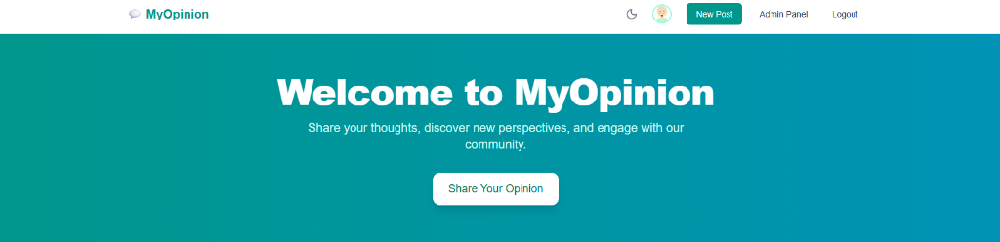
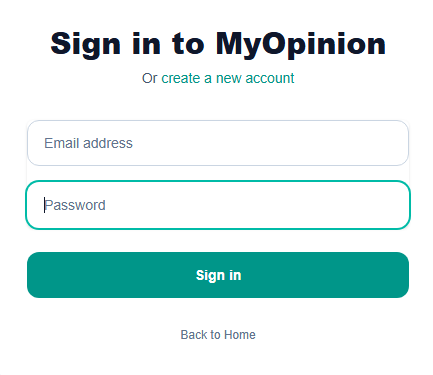
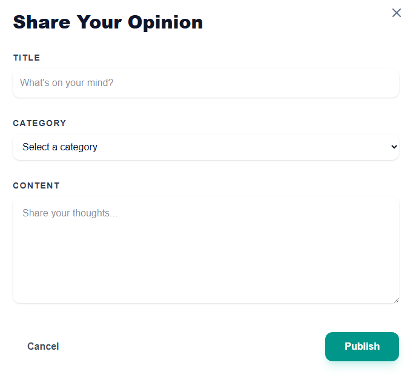

# 💬 MyOpinion Forum Application

Complete instructions to set up the backend and frontend

---

## 🛠️ Tools & Frameworks Used

**Backend:**
- ⚡ .NET 8, ASP.NET Core Web API
- 🗄️ Entity Framework Core
- 📦 SQLite

**Frontend:**
- ⚛️ React + Vite
- 🎨 TailwindCSS (utility-first styling)
- 🔄 Zustand (state management)
- ✨ Lucide React (icons)

Follow the steps below to get everything running locally.

---

## 📋 Prerequisites

Make sure you have these installed on your system:

◆ .NET 8 SDK  ◆  Node.js 18+ & npm  ◆  Git

---

## 🖥️ Backend Setup

1. Clone the repository:

```bash
git clone https://github.com/ManolisLoulakis/codingfactory-final-project.git
cd codingfactory-final-project
```

2. Navigate to the API folder and run:

```bash
cd ForumApp.API
dotnet run
```

> 💡 **Note:** The database is created automatically on first run with demo data (10 users, 12 posts, 30+ comments).

✅ The backend should now be running on http://localhost:5071

📖 Swagger API documentation: http://localhost:5071/swagger

---

## 🌐 Frontend Setup

1. Open a new terminal and navigate to the client folder:

```bash
cd client-app
```

2. Install dependencies:

```bash
npm install
```

3. Run the development server:

```bash
npm run dev
```

✅ The frontend will be available at http://localhost:5173

---

## 👤 Demo Accounts

The application comes with pre-configured test accounts:

| Role | Email | Password |
|------|-------|----------|
| 👑 **Admin** | admin@myopinion.com | Admin123! |
| 👤 User | john@example.com | User123! |
| 👤 User | jane@example.com | User123! |
| 👤 User | mike@example.com | User123! |

*All demo user accounts have the password `User123!`*

---

## ⭐ Features

**👤 User Features:**
- 📝 Create posts and comments
- 🏷️ Browse discussions by category  
- 🔍 Search posts
- 🌙 Dark/Light mode toggle

**👑 Admin Features:**
- 🗑️ Delete any post or user
- 🔇 Mute users (prevent posting for a duration)
- 🚫 Ban users (prevent login for a duration)

---

## 📸 Screenshots

| Home Page | Login | Create Post |
|:---------:|:-----:|:-----------:|
|  |  |  |
| *Welcome screen* | *Authentication* | *Share your opinion* |

---

## 📁 Project Structure

```
├── ForumApp.API/           # ASP.NET Core Web API
├── ForumApp.Core/          # Domain entities & interfaces
├── ForumApp.Infrastructure/ # Data access & repositories
├── ForumApp.Services/      # Business logic & DTOs
└── client-app/             # React frontend
```

---

## 🔌 API Endpoints

| Method | Endpoint | Auth | Description |
|--------|----------|:----:|-------------|
| `POST` | `/api/auth/register` | - | Register new user |
| `POST` | `/api/auth/login` | - | Login |
| `GET` | `/api/posts` | - | Get all posts |
| `POST` | `/api/posts` | 🔐 | Create post |
| `POST` | `/api/posts/comments` | 🔐 | Add comment |
| `DELETE` | `/api/posts/{id}` | 🔐 | Delete post |
| `GET` | `/api/categories` | - | Get categories |

---

<p align="center">
  Made with ❤️ for Coding Factory Final Project
</p>
